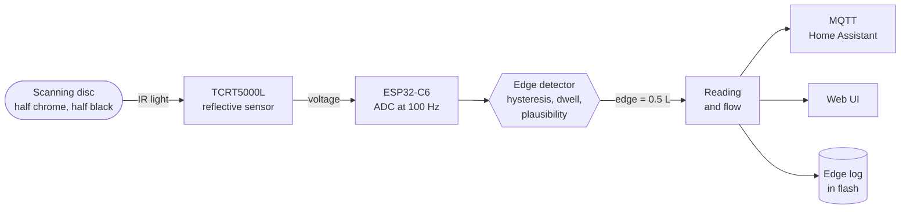

# flowtick-meter

**A battery-free optical reader for water meters with a scanning disc.**

Many mechanical water meters carry a small disc in their register that turns
with the flow (half mirror-bright, half black) so that a plug-in module can
count its revolutions. The vendor's pulse modules run on a glued-in lithium cell
and are thrown away when it is empty. flowtick-meter replaces such a module with
a 3D-printed case holding a **Vishay TCRT5000L** reflective sensor and an
**ESP32-C6**, powered over USB. Every bright/dark edge of the disc is one *tick*
of a fixed volume; the reading goes to **MQTT / Home Assistant** and a built-in
web interface.

<p align="center">
  
  
</p>

## How it works




The sensor sits a few millimetres above the disc. Chrome reflects the IR LED
into the phototransistor, black does not; the voltage swings by about 2.4 V.
The firmware turns that into edges, counts them and keeps the reading across
restarts. Details: [docs/how-it-works.md](docs/how-it-works.md).

One revolution of the disc on a real meter, as the built-in scope shows it:
chrome at ~3 V, black at ~0.5 V, both thresholds dashed, every detected edge
as a green line.


## Features

- **Web interface**: reading, flow, water draws, a **live oscilloscope** of the
  raw sensor signal for tuning, all settings; every tab has its own URL.
- **Robust edge detector**: two thresholds (hysteresis), a dwell time against
  spikes, a minimum gap between edges, and a fault mode: a removed adapter or
  light falling in stops counting, and on return the detector resynchronises
  without inventing an edge.
- **Edge log**: every edge with its time in a flash ring that survives power
  cuts, written append-only so it does not wear out the flash; CSV export.
- **Reading kept safe**: saved once a minute when it changed and before every
  restart.
- **WiFi setup**: captive portal on first start; network changes are tested
  before they are stored, and the page follows the device to its new address.
- **OTA updates** with automatic rollback, from the web UI or `curl`.
- **MQTT** with `mqtt://` or `mqtts://` (built-in public CAs, own CA, or
  unchecked), optional login, **Home Assistant discovery**: meter reading for the
  energy dashboard, flow, a *Continuous flow* leak warning and a status entity
  with device diagnostics.
- **Time** from a configurable NTP server with a built-in fallback, timezone
  selectable.

## Supported meters

| Meter | Interface | Volume per edge | Status |
|---|---|---|---|
| [Allmess EVK 3/110 +m](meters/allmess-evk-3-110-m/) | `+m` module bay, optical scanning disc | 0.5 L | working |

The same module bay is used across the Allmess `+m` family, so other meters of
that family very likely fit the same case. Another meter? See
[docs/adding-a-meter.md](docs/adding-a-meter.md).

## Quick start

1. **Get the parts**: ESP32-C6 Super Mini, TCRT5000L, two resistors, black
   PETG; list in [docs/hardware.md](docs/hardware.md).
2. **Solder** the sensor circuit: [docs/hardware.md](docs/hardware.md),
   schematic in [docs/schematic.png](docs/schematic.png).
3. **Print the case** for your meter from [`meters/`](meters/), e.g.
   [meters/allmess-evk-3-110-m/](meters/allmess-evk-3-110-m/).
4. **Build and flash** the firmware: [docs/firmware.md](docs/firmware.md).
5. **Connect** to the `flowtick-xxxxxx` network, enter your WiFi, then
   **tune** thresholds and set the reading: [docs/tuning.md](docs/tuning.md).
   For a supported meter the tested values can be used as they are.

## Repository layout

```
.
├── docs/                  how it works, hardware, firmware, tuning, new meters
├── firmware/              ESP-IDF firmware (C++20, PlatformIO) and web UI
└── meters/
    └── allmess-evk-3-110-m/
        ├── cad/           OpenSCAD source of the case
        ├── stl/           ready-to-print parts
        ├── images/        renders
        └── photos/        photos of the build and the meter
```

## Contributing

New meters, fixes and measurements are welcome, see
[CONTRIBUTING.md](CONTRIBUTING.md).

## Licence

[Apache License 2.0](LICENSE) for everything in this repository: firmware, CAD
models, documentation and images. Copyright 2026 Jonas Brüstel. Firmware images
also contain third-party components, listed in
[THIRD-PARTY-NOTICES.md](THIRD-PARTY-NOTICES.md).

flowtick-meter is not affiliated with or endorsed by any meter manufacturer.
Brand and model names are used only to say which meter a part fits.
