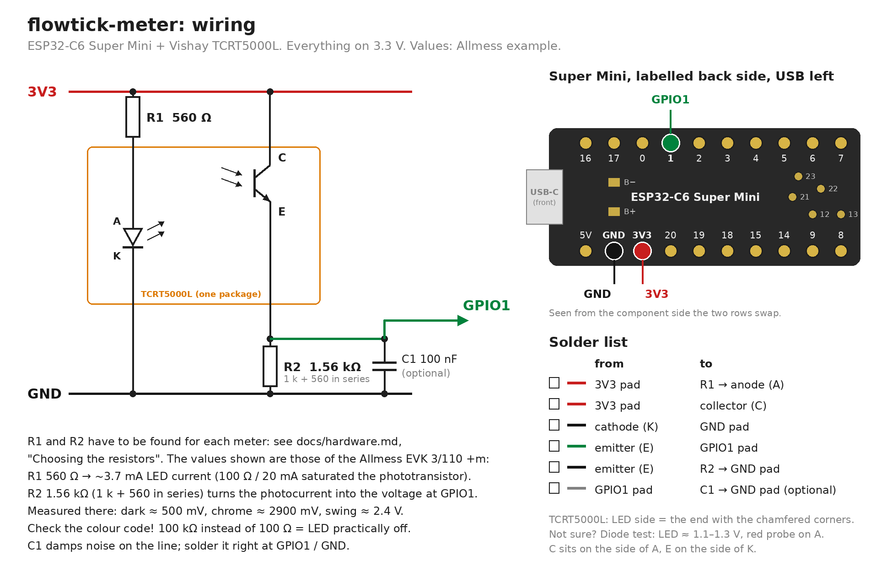

# Hardware

The electronics are the same for every meter: an ESP32-C6 Super Mini and a bare
Vishay TCRT5000L reflective sensor, plus two resistors. Only the two resistor
values and the printed case change from meter to meter.

Generated by [`schematic.py`](schematic.py) (`cd docs && python3 schematic.py`,
needs Pillow and the DejaVu fonts). The values shown are those of the
[Allmess EVK 3/110 +m](../meters/allmess-evk-3-110-m/README.md).

## Circuit

* **LED branch:** 3V3 → **R1** → anode (A) → cathode (K) → GND
* **Transistor branch:** 3V3 → collector (C) → emitter (E) → **GPIO1**, and
  from the emitter **R2** to GND
* **C1** (100 nF, optional) right at the board between GPIO1 and GND

**Signal direction:** the bright (chrome) sector reflects a lot, the
phototransistor conducts more, and the voltage at GPIO1 rises. The dark sector
gives a low voltage. The firmware turns every crossing between the two into an
edge; see [tuning.md](tuning.md).

**Everything runs on 3.3 V.** The bare TCRT5000L has no "operating voltage":
it is an IR LED and a phototransistor. The "5 V" in shop listings refers to the
breakout boards with an LM393 comparator. With the collector on 3V3, GPIO1 can
never see more than 3.3 V, and the IR output depends on the current, not on
the voltage.

### ESP32-C6 Super Mini

| Function | Pin |
|---|---|
| ADC input (phototransistor emitter) | **GPIO1** |
| Status LED (active high) | GPIO15 |
| BOOT button | GPIO9 |
| IR LED supply | 3V3 (always on) |

* ADC1 sits on GPIO0–GPIO6; there is no ADC2. The board breaks out GPIO0–3,
  8–9 and 12–23 (plus TX/RX), so GPIO0–GPIO3 are the usable ADC pins.
* Keep clear of GPIO8 (RGB LED), GPIO9 (BOOT), GPIO12/13 (USB D−/D+) and
  GPIO15 (status LED).
* Pad rows as printed on the labelled back side, USB-C on the left:
  top: 16 (TX), 17 (RX), 0, 1, 2, 3, 4, 5, 6, 7;
  bottom: 5V, GND, 3V3, 20, 19, 18, 15, 14, 9, 8.
  Seen from the component side the two rows swap. The back also has B+ / B−
  battery pads and the inner pads 12, 13, 21, 22, 23.
  Only **GND, 3V3** and **GPIO1** are used.

### Why not a TCRT5000 breakout board

The common modules with a potentiometer and an LM393 (32 × 14 mm) are too big
for a meter's module bay, usually only bring out the digital output, and have
barely any hysteresis. Hysteresis, dwell time and plausibility checks are done
in the firmware instead ([firmware.md](firmware.md)). The boards still make
good part donors: desolder the TCRT5000 and use it bare.

## Bill of materials

Per meter:

| Part | Purpose | Notes |
|---|---|---|
| **ESP32-C6 Super Mini** | controller, 4 MB flash | |
| **Vishay TCRT5000L**, through-hole, bare | reflective sensor over the scanning disc | buy a few, one or two tend to die while soldering and fitting |
| **R1** | IR LED series resistor | value per meter, see below |
| **R2** | phototransistor emitter resistor | value per meter, see below |
| C1, 100 nF ceramic | noise filter at GPIO1 | optional |
| thin stranded wire | sensor → board | a few cm, 3 or 4 wires |
| 2 × **M2 × 8** self-tapping screws | cap to adapter | for the Allmess case; other cases may differ |
| **PETG**, black | printed case | black, so no stray light reaches the sensor |
| USB-C cable + 5 V supply | permanent power | |

To find R1 and R2 for a new meter, have a small assortment at hand:
**220 Ω, 560 Ω, 1 kΩ, 2.2 kΩ, 4.7 kΩ, 10 kΩ**. Two in series give the values in
between.

Tools: soldering iron and heat-shrink tubing, a multimeter with a diode test,
calipers, a 3D printer.

## Identifying the TCRT5000L pins

The part is not marked.

* **LED side** = the end with the **chamfered corners**.
* **Diode test** on the LED pair: about 1.1–1.3 V forward, **red probe on the
  anode (A)**. The transistor pair shows no diode drop in either direction.
* **C sits on the side of A, E on the side of K.**
* Check: collector to 3V3, emitter through R2 to GND. Holding white paper
  2–3 mm in front, the emitter voltage has to rise.
* A phone camera often does **not** show the IR LED (many have an IR filter).
  No glow in the picture does not mean it is dead; measure the voltage across
  R1 instead (about 2.1 V with 560 Ω).

## Choosing the resistors

**This is the one part that has to be worked out for every meter.** The sensor
sits at a different distance from the disc, behind a different window, looking
at a disc that reflects differently. A pair of resistors that gives a perfect
signal on one meter can saturate on the next or barely move on a third.

### What each one does

* **R1 sets the LED current**, about `(3.3 V − 1.2 V) / R1`. Smaller R1 → a
  brighter LED → more photocurrent over **both** sectors. 560 Ω gives
  ≈ 3.7 mA, 220 Ω ≈ 9.5 mA, 100 Ω ≈ 21 mA. Do not go below ~100 Ω (≈ 20 mA);
  less current also means less ageing of the LED.
* **R2 turns the photocurrent into the voltage at GPIO1.** Larger R2 → more
  voltage for the same light → more sensitive, again for both sectors.

Both scale the bright and the dark level together. What you are after is the
**gap** between them, inside the window the ADC and the firmware can use.

### The target

| | Target | Why |
|---|---|---|
| dark sector | clearly above **~300 mV** | below that a sensor that came loose looks like "dark"; the plausibility limit is 50 mV |
| bright sector | clearly below **3250 mV**, not saturated | above 3250 mV the firmware treats the signal as implausible (Fault); near 3.3 V the ADC also gets non-linear |
| swing (bright − dark) | **≥ 500 mV**, more is better | the thresholds sit at roughly 30 % and 70 % of it |

**Saturation** looks like this: the bright sector is a flat plateau around
3.1–3.3 V instead of a profile, and changing the light hardly changes the
reading. The swing is then smaller than it could be, and the dark level is
often too high as well.

### Procedure

1. **Start values:** R1 = 560 Ω, R2 = 1.5–2.2 kΩ.
2. Mount the sensor in its case **on the meter**, closed as in use. The
   distance and the stray light are what you are tuning for.
3. Open the web UI, **Tuning** tab, press **Reset min/max**.
4. Let water run (or, on a meter you can turn, turn the disc) for a few full
   revolutions. Read **Min**, **Max** and **Swing**, and look at the live
   trace.
5. Change one resistor, reset min/max, repeat:

| Symptom | Change |
|---|---|
| bright sector flat near 3.1–3.3 V, swing small | saturated: **raise R1** (dimmer LED) or **lower R2** |
| both levels low, small swing | **lower R1** (not below ~100 Ω) or **raise R2** |
| dark level below ~300 mV, bright level fine | small step up in sensitivity (a bit larger R2 or smaller R1), watching that the bright sector does not saturate; the dark level needs headroom above the loose-sensor case |
| noisy trace, spikes | close the case (stray light), fit **C1**, keep the signal wire short |
| no reaction at all | check the LED with the diode test, measure R1 (colour code!), check A/K/C/E |

6. When the levels are right, set the thresholds and the volume per edge:
   [tuning.md](tuning.md).

Values in between come from **two resistors in series**: 1 kΩ + 560 Ω =
1.56 kΩ, 2.2 kΩ + 1 kΩ = 3.2 kΩ.

**Measure every resistor before soldering it in.** The first build here had
100 kΩ (brown black **yellow**) in the LED branch instead of 100 Ω (brown black
**brown**). The LED then gets about 20 µA and stays practically dark, and the
sensor looks broken.

### Worked example: Allmess EVK 3/110 +m

The textbook values were far too sensitive: the chrome sector is a mirror
2–3 mm in front of the sensor.

| R1 | R2 | Result |
|---|---|---|
| 100 Ω | 10 kΩ | chrome 3160–3260 mV, saturated |
| 220 Ω | 2.2 kΩ | still saturated |
| **560 Ω** | **1.56 kΩ** (1 k + 560) | **dark ≈ 500 mV, chrome ≈ 2900 mV, swing ≈ 2.4 V** |

For this meter nothing needs changing: build it with 560 Ω and 1.56 kΩ. The
meter's own page has the rest:
[meters/allmess-evk-3-110-m](../meters/allmess-evk-3-110-m/README.md).

## Wiring in a small case

Space inside a module bay is tight. Two ways to place the resistors:

1. **At the sensor.** Solder R1 and R2 straight onto the sensor legs and
   insulate them with heat-shrink. Only **three wires** run to the board:
   3V3, GND and the signal (emitter). The cleanest option.
2. **On the board side.** R1, R2 (and C1) lie next to the board where the case
   leaves room; four wires (A, K, C, E) run from the sensor.

* Fit **C1**, if used, right at the board between GPIO1 and GND.
* Keep the wires short; at a few centimetres no shielding is needed.
* The board sits in the case component side towards the lid. The stand-off
  ribs in the case are interrupted at the soldered pads (GND, 3V3, GPIO1), so
  the solder joints and wires have room.

## Power

USB-C, 5 V, well under 100 mA. Any phone charger will do; plan for permanent
power, not a battery.

The Super Mini has a green charge LED on BAT that blinks continuously when
running from USB without a battery. It cannot be switched off in software;
desolder it if it bothers you. A resistor between BAT and GND does not help, it
only blinks faster.

## Next

* Firmware, flashing and the web UI: [firmware.md](firmware.md)
* Thresholds, edge filter, volume per edge: [tuning.md](tuning.md)
* Supporting a new meter: [adding-a-meter.md](adding-a-meter.md)
