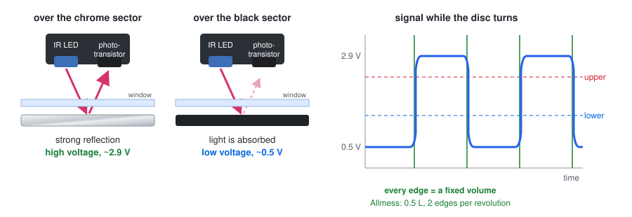
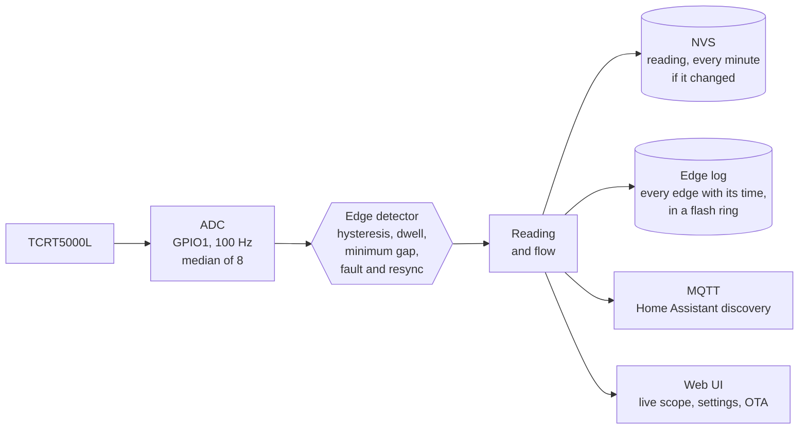

# How it works

## The scanning disc

Many mechanical water meters have a small **scanning disc** in the register
next to the number rollers. It turns with the flow, and one part of it is
bright (chrome or white) while the rest is dark. It is there for the
manufacturer's own add-on modules, which read it optically and turn it into
pulses, M-Bus or radio telegrams.

flowtick-meter reads the same disc. It puts its own reflective sensor in the
module bay, in place of the vendor module:

When the disc turns, the sensor sees a square wave: a high voltage over the
bright sector and a low voltage over the dark one. Every change from one to
the other is an **edge**, and every edge is a fixed amount of water.

**Example: Allmess EVK 3/110 +m.** The dial is marked `x0,0001`, so the disc
makes 1000 revolutions per m³, which is **1 L per revolution**. It is half
chrome and half black, so there are 2 edges per revolution, which makes
**0.5 L per edge**. The vendor pulse module only resolves 1 L. Details are in
[meters/allmess-evk-3-110-m](../meters/allmess-evk-3-110-m/README.md).

## Why not the vendor module

Vendor pulse modules work, but they run on a **glued-in lithium cell**. The
Allmess PM +m, for example, is rated for 13 years. Water meters have to be
replaced for recalibration every few years. On a 6-year cycle, that means
buying a new module every second meter swap, for the price of a whole
flowtick build several times over.

A mains-powered reflective sensor has no battery to run down. The module bay
is usually identical across a manufacturer's whole meter family, so a case you
have built once also fits the next meter.

The disc is read optically, not magnetically. Manufacturers avoid reed
switches because a magnet held against the meter could fool them. For us, it
means the sensor we need is just a simple reflective coupler.

## Signal chain

* **Sensor.** An IR LED and a phototransistor in one package, the Vishay
  TCRT5000L. Two resistors set the LED current and the gain. They are chosen
  per meter, see [hardware.md](hardware.md#choosing-the-resistors).
* **ADC.** The ESP32-C6 samples at 100 Hz and takes the median of 8 readings
  per sample.
* **Edge detector.** Two thresholds with hysteresis. A crossing has to last
  80 ms, edges have a minimum spacing, and implausible signals pause counting.
  For example, the signal goes implausible when the case is taken off or light
  gets in. See [firmware.md](firmware.md#how-edges-are-counted).
* **Reading.** The total in millilitres is saved to flash every minute if it
  has changed, and before every deliberate restart. Every edge also goes into
  an append-only log that does not wear out the flash.
* **Outputs.** MQTT with Home Assistant discovery, and a web interface with a
  live oscilloscope for tuning.

## Alternatives, and why this one

| Approach | Upside | Downside |
|---|---|---|
| **Vendor pulse module** | plug in, done | glued-in battery, buy again with every few meters; often only 1 L resolution |
| **Vendor M-Bus module** | absolute reading from the meter | needs an M-Bus master and the vendor's programming tools; expensive |
| **Vendor wireless M-Bus** | no wires | telegrams are often encrypted, with the key only from the utility; some have no open-source decoder (e.g. Itron/Allmess EquaScan has no wmbusmeters driver) |
| **Camera + OCR** ([AI-on-the-edge-device](https://github.com/jomjol/AI-on-the-edge-device)) | reads the real absolute register, nothing touches the meter | lighting and ROI tuning are fiddly, coarser resolution, a camera mounted in front of the meter for good |
| **Magnetic / inductive sensors** | work on meters with a magnet or metal target | many modern meters have neither, on purpose |
| **Reflective sensor on the scanning disc** (this project) | no battery, sub-litre resolution, reusable across a meter family | needs a case for the module bay and a one-time tuning of two resistors |

A camera is a serious alternative if you are not allowed to use the module
bay. If the meter belongs to the utility or the landlord, putting your own
hardware into it can count as tampering with a calibrated device, so ask
first.
