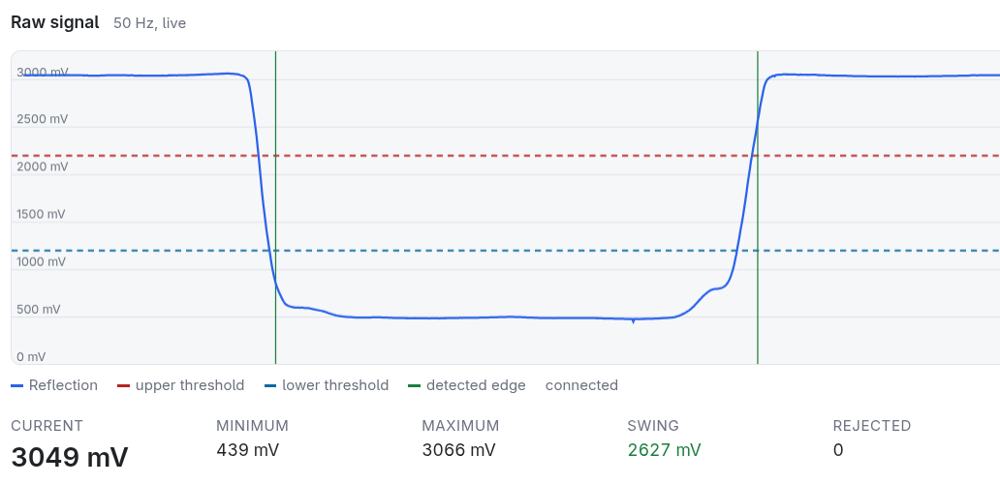

# Tuning and calibration

You do all of this in the device's web interface, without reflashing. Values
are stored in NVS right away and survive restarts and OTA updates.

| Setting | Where | Allmess EVK 3/110 +m |
|---|---|---|
| Upper / lower threshold | *Tuning* → *Thresholds* | 2200 / 1200 mV |
| Dwell, minimum gap | *Tuning* → *Edge filter* | 80 / 150 ms (default) |
| Volume per edge | *Tuning* → *Volume per edge* | 500 ml (default) |
| Meter reading | *Settings* → *Match the mechanical register* | from the number rollers |

The defaults in the firmware are the Allmess values. A factory reset leaves
you with a counting meter if your hardware matches that one.

---

## 1. Check the signal swing

1. Mount the case on the meter, connect the device to WiFi, open the web
   interface and go to **Tuning**. The scope shows the raw signal live at
   50 Hz. It also shows both thresholds as dashed lines and every detected
   edge as a vertical line.
2. Press **Reset min/max**.
3. Let water run until the disc has turned a few times. At 1 L per revolution
   a few litres are enough.
4. Read **Current**, **Minimum**, **Maximum** and **Swing**.



This is what a good signal looks like: flat levels well apart, steep
transitions that cross both thresholds cleanly, one green edge line per
transition and **Rejected** at 0.

Aim for a swing of **at least 500 mV**, with the signal clear of both rails.
The Allmess example reaches this:

| | |
|---|---|
| dark sector | ~500 mV |
| bright (chrome) sector | ~2850–2990 mV |
| swing | ~2.4 V |

Problems at this stage are usually hardware:

* **Signal stuck high at ~3.1–3.3 V on both sectors.** The phototransistor is
  saturated. Raise R1 (less LED current) or lower R2.
* **Swing small, both levels low.** Not enough light comes back. Lower R1 or
  raise R2. Also check that the sensor is close to the window and looks at the
  disc.
* **Swing small, both levels in the middle.** The sensor is probably looking
  past the disc, or at the window's reflection.

See [hardware.md → Choosing the resistors](hardware.md#choosing-the-resistors)
for the procedure.

## 2. Set the thresholds

**Derive thresholds from swing** fills in 30 % and 70 % of the measured swing.
Nothing is stored until you press **Save**. There are two thresholds rather
than one because a single threshold makes the signal bounce at the transition,
and every edge then counts several times.

With 500 / 2900 mV that gives ~1220 / 2180 mV. The Allmess setup rounds these
to **1200 / 2200 mV**.

## 3. Edge filter

* **Dwell** (80 ms): a crossing only counts once the signal has stayed beyond
  the threshold this long. Shorter excursions, such as a flash of light or
  bounce at the transition, are counted as **Rejected** and marked at the top
  of the scope.
* **Min. gap** (150 ms): two edges closer than this are physically impossible,
  so the second one waits. On the Allmess meter, edges are 0.58 s apart at the
  overload flow Q4 = 3.1 m³/h.

**Rejected** should stay at 0 while water runs. If it climbs on real edges, a
threshold sits too close to one of the sector levels.

The firmware also checks plausibility. If the signal is outside 50–3250 mV for
more than 0.5 s, it goes to *Fault* and stops counting. After 2 s of steady
signal it resynchronises (*Resync*): it waits until the signal is clearly
beyond one threshold and takes that as the current sector, without counting
an edge. It does the same after every restart.

## 4. Volume per edge

This is a property of the meter, not of the sensor. Work it out once per meter
model:

1. **From the dial.** The scanning disc usually has its own scale in the
   register, for example `x0,0001` (m³ per revolution) or a marking like
   `1000.0x` (revolutions per m³). Each bright/dark pair of sectors on the
   disc gives 2 edges per revolution:

   ```
   ml_per_edge = 1000 × litres_per_revolution / edges_per_revolution
   ```

   Allmess: 1 L per revolution, half bright and half dark, so 2 edges per
   revolution and **500 ml**.

2. **Bucket test**, to check the result or when there is no scale. Note the
   reading, draw exactly 10 L (weigh it: 10 kg = 10.0 L), then read it again:

   ```
   ml_new = ml_current × 10.0 / (L_after − L_before)
   ```

   Expect a round value such as 250, 500 or 1000 ml. An odd value almost always
   means false edges, so go back to step 3.

Over days, the reading in the web interface should keep pace with the number
rollers.

## 5. Match the mechanical register

Read the number rollers and enter the value under **Settings → Match the
mechanical register**. The value is absolute, not a correction, so sending it
twice does no harm. On the Allmess meter the black digits `00044` and the red
ones `2670` make `44.2670`. You can also set it through the API; add
`-u admin:<password>` if a password is set:

```sh
curl -X POST http://192.168.1.50/api/v1/meter/total -d '{"m3": 44.2670}'
```

Read it while no water is running, so that the rollers and the device agree.

## Taking the case off

Press **Settings → Taking the adapter off → Pause counting** first. When you
resume, the device first checks which sector the sensor sees and only then
counts again, so putting the case back cannot add phantom litres. If you
forget to pause, the plausibility check catches most of it (Fault after
0.5 s), but a single edge can slip through.

## Ongoing checks

Once a year is enough, ideally when you read the meter for the yearly bill.
Compare the rollers with the web interface and set the reading again if
needed.

The reading is saved every minute if it has changed, and before every
deliberate restart, so a power cut costs at most one minute of consumption. If
the reading drifts steadily, either the volume per edge is wrong or the sensor
has moved. The edge log under **Meter → Water draws** helps narrow it down,
because every edge is in it with a timestamp.
