# Allmess EVK 3/110 +m

Cold water meter by Allmess with a **+m module bay**: a standard slot for a
plug-in communication module (pulse, M-Bus or wireless M-Bus), fitted without
removing the meter or touching its calibration. As delivered, the bay holds a
**blank module** ("Leermodul") that is just a dust cover. The flowtick-meter
case replaces it: a printed adapter in the shape of the blank module, carrying
the reflective sensor over the scanning disc and the ESP32-C6 Super Mini in
front of it.

**Status:** printed and running. The snap fit was verified with fit tests on
the real meter, and the counting matches the mechanical register.

| 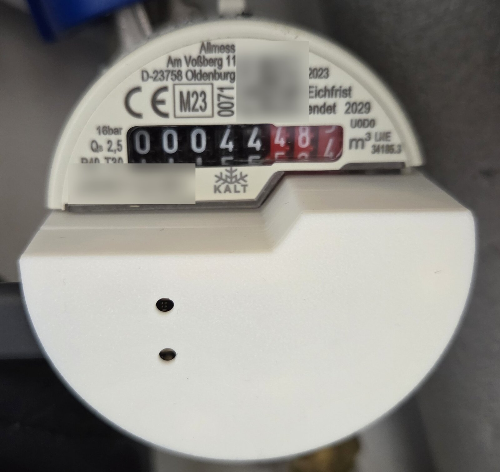 | 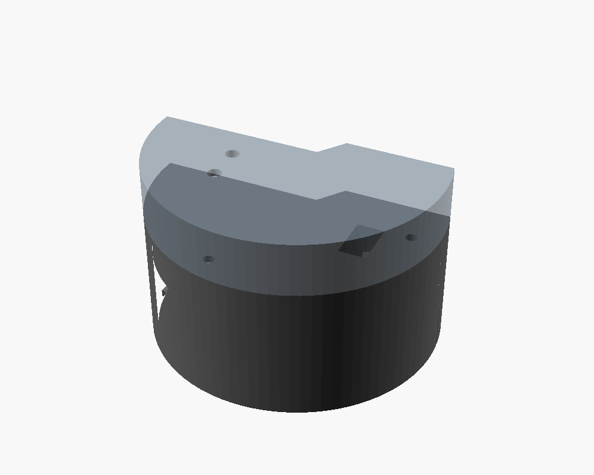 |
|---|---|
| on the meter | the CAD model |

## The meter

| | |
|---|---|
| Meter | Allmess EVK 3/110 +m, cold water |
| Interface | +m module bay, optical (no magnet, no reed contact) |
| Scanning disc | under the clear window to the right of the roller register, **half chrome, half black** |
| Disc ratio | dial marked **x0,0001**: 1000 revolutions per m³ = **1 L per revolution** |
| Edges | 2 per revolution (chrome→black, black→chrome) = **0.5 L per edge** |
| Original pulse module (PM +m) | at best 1 L per pulse, battery for ~13 years |

| 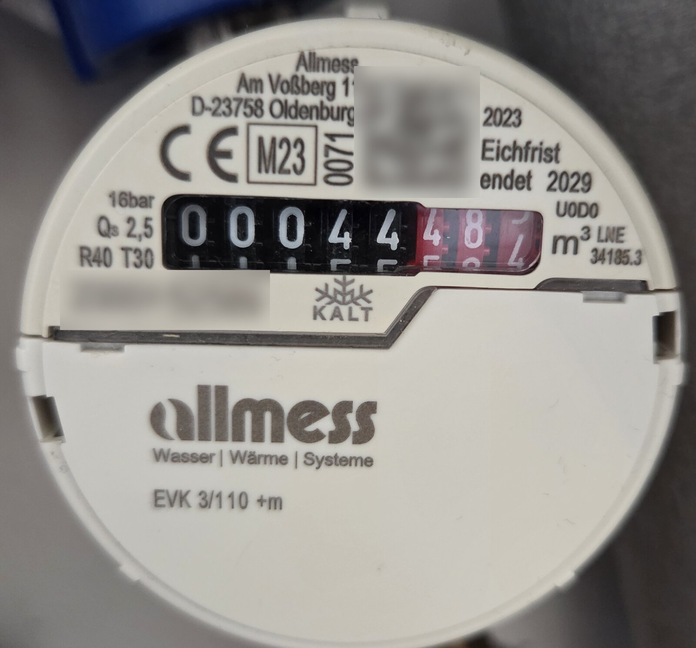 | 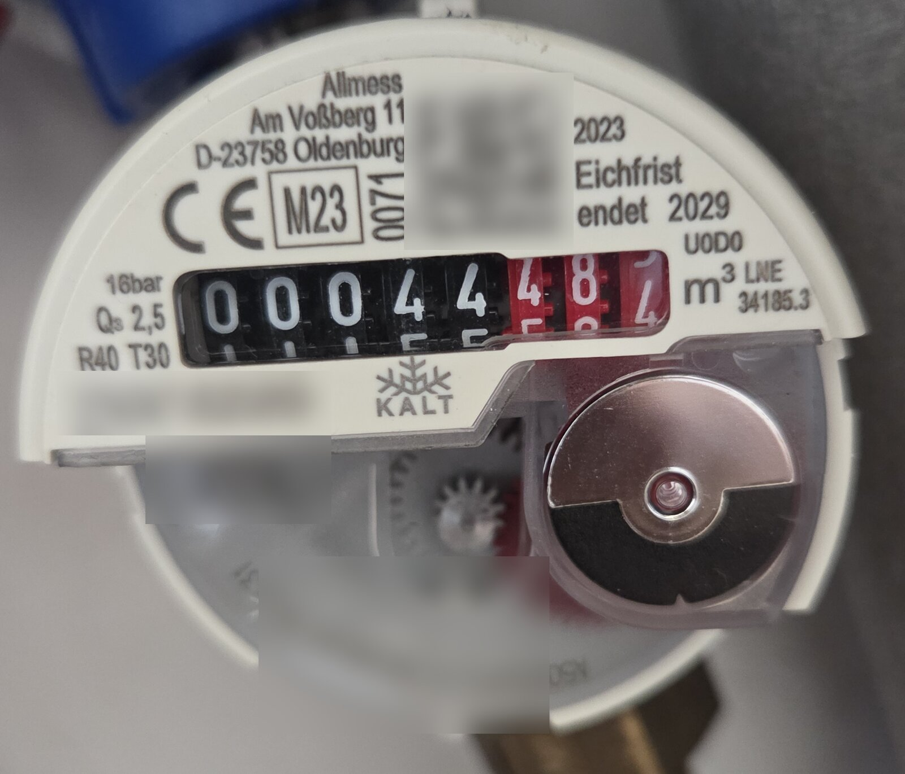 | 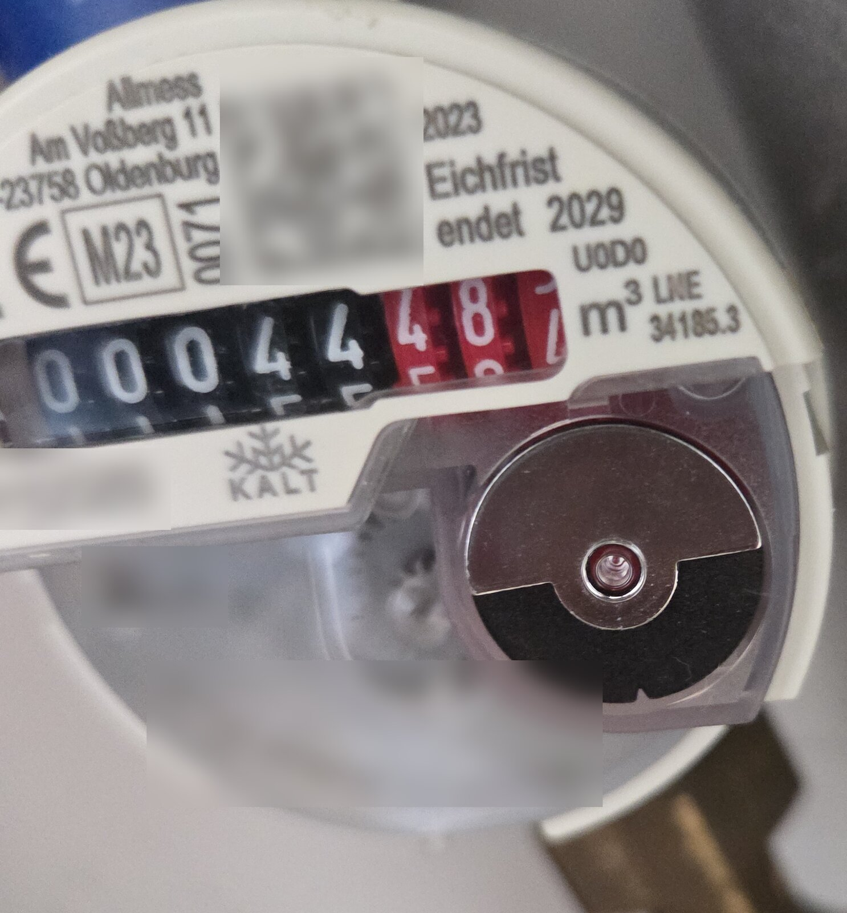 |
|---|---|---|
| as delivered, with the blank module | blank module removed: the disc sits under the clear window | the disc, half chrome, half black |

The +m register is the same across the Allmess family (EVK, EV, WTZ,
System-V, System-MK, AMES measuring capsule): same bay, same snaps, same
disc. A case built once also fits the meter that replaces this one when its
calibration period runs out.

**Before you start:** taking the blank module off tears the name plate at its
perforation and cannot be undone. If the meter belongs to the utility or the
landlord, your own hardware in the module bay may count as tampering with a
calibrated device; ask first.

## The module bay

The adapter replaces the blank module that sits in the bay when no
communication module is fitted. Its outline is a copy of that blank module,
taken from a flatbed scan. Only the round wall touches the meter; the clear
window over the disc pokes past the straight edge, which is what the nose of
the case is for. All dimensions are parameters in
[`cad/housing.scad`](cad/housing.scad).

## The case

Two parts, joined by two screws, both printable **without support**. Source:
[`cad/housing.scad`](cad/housing.scad) (OpenSCAD, fully parametric).

| Part | `part=` | What it does | Print orientation |
|---|---|---|---|
| **Adapter** | `adapter` | copy of the blank module: round wall, snap tongues, sensor sleeve | front face down |
| **Cap** | `cap` | compartment for the Super Mini, sits on the front of the adapter | lid down |

| Adapter front | Without the cap | Laid out for printing |
|---|---|---|
| 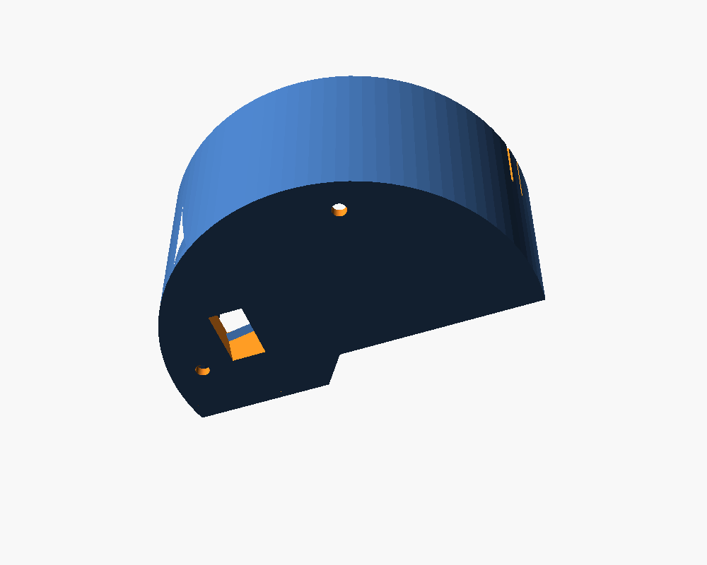 | 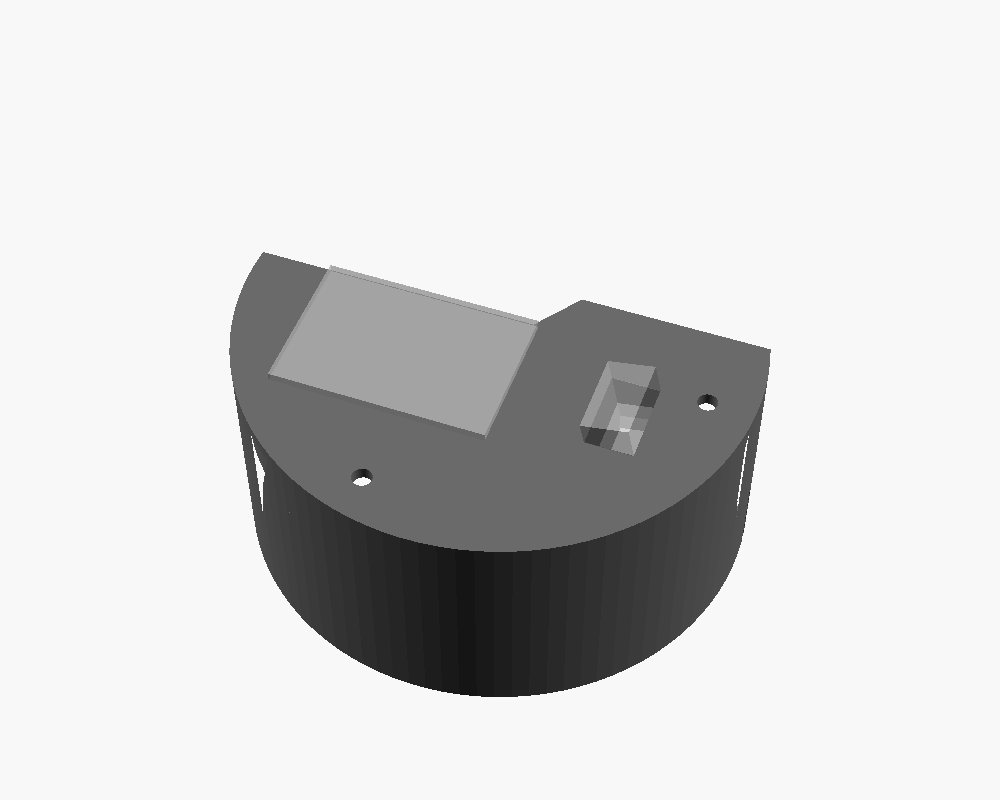 | 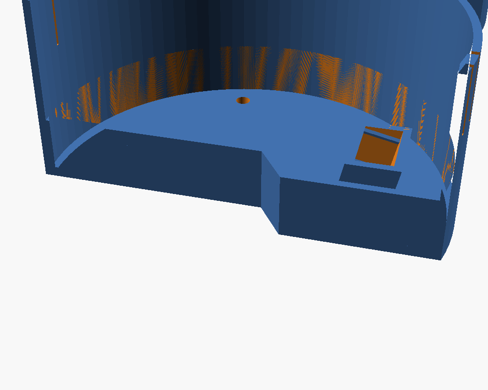 |

### Adapter

* **6 mm deeper than the original** (`lift`, 29.5 instead of 23.5 mm). The
  front plate moves out; the rim against the meter and the snap tongues stay
  where the original had them.
* **Sensor sleeve** in the 6 mm gained, from the front plate backwards, ending
  where the floor of the original was, right in front of the window. The
  TCRT5000L peaks at 2.5 mm and the window is ~5 mm behind the original front
  plate, so the sensor has to reach in. It sits 4.5 mm below the disc centre
  (`sensor_off`, `sensor_dir = -90`), lens axis radial, so both lenses see the
  rotating sectors, and is **tilted 12°** about the lens axis (`tilt`) so the
  direct reflection off the window misses the phototransistor.
* **Stop in the sleeve:** two 45° wedges (`stop`, 1 mm) at the short ends. The
  narrow lens end (~6.8 mm) passes, the shoulders of the TCRT5000L rest on
  them. The window can push the sensor back, so it finds its own distance.
* **Press fit**, 0.05 mm undersize per side (`press`); find yours with the slot
  test.
* **Rim** along the straight edge, the chamfer and the nose: 4 mm + `lift` from
  the front.
* **Snap tongues** 10 mm long (`slot_depth`; the original ~4 mm ones broke)
  with a 0.8 mm catch (`catch_h`) and a lead-in ramp. The left one sits 1 mm
  further towards the straight edge than the scan, from fit tests.

Switched off, but still in the model as parameters:

| Parameter | What | Why off |
|---|---|---|
| `inner_wall_on` | straight inner wall as on the original | the rim is enough; it gets in the way when fitting |
| `ribs_on` | the three ribs inside | switch on if the adapter wobbles |
| `pocket_wall` | cup around the pocket | the case is black anyway; a slightly misplaced cup would sit on the window |
| `release_windows` | windows over the snap tongues | cannot be reached under the cap |

### Cap

* The Super Mini (26.04 × 18 mm) lies across, **components towards the lid**,
  USB-C to the left, beside the sensor rather than over it; the antenna end
  faces the sensor.
* It hangs in **four corner brackets** from the lid and snaps in past small
  lips (`lip = [0.3, 1.2]`: 0.3 mm undercut, 1.2 mm ramp), 5.3 mm below the
  lid (`board_stand`, room for the plug overmould). Ribs from the lid support
  both pin rows, broken where wires are soldered (GND, 3V3, GPIO1).
* The board sits as far left as the round allows (`board_pos`), leaving 7.2 mm
  between board and sensor sleeve for R1, R2 and C1.
* Opening for the USB-C plug in the left wall (`usb_notch`, 13 × 10 mm), holes
  in the lid for BOOT and RST. The status LED shines through the lid.

### Screws

2 × **M2 × 8 self-tapping**, **from behind** through the adapter front into
bosses in the cap (`screws`): pilot hole 1.7 mm, clearance 2.4 mm, pan or
cheese head up to 4.2 mm (no countersink). The heads sit hidden inside the
adapter and the front stays flat; the price is that the screws go in before
the adapter goes onto the meter.

### Key parameters

| Parameter | Value | Meaning |
|---|---|---|
| `R` | 31.75 | outer radius |
| `D0`, `lift` | 23.5, 6.0 | original depth, extra depth for the sensor sleeve |
| `edge_y` | 2.5 | straight edge above the centre |
| `pocket_c` | [17.83, −2.79] | disc centre |
| `sensor_off`, `tilt` | 4.5, 12 | sensor offset from the disc centre, tilt about the lens axis |
| `press` | 0.05 | sensor slot undersize per side |
| `snap_right`, `snap_left` | see scad | slot and tongue extents along y |
| `slot_depth`, `catch_h` | 10, 0.8 | tongue length, catch height |
| `board_pos`, `board_stand` | [−21.0, −18.8], 5.3 | board corner, lid to board |
| `screws` | [[−7, −25.5], [26, −2]] | screw positions |

## Printing

| | |
|---|---|
| Material | **PETG, black** |
| Layer height | 0.15–0.20 mm |
| Perimeters | **4** |
| Infill | 30 % |
| Support | **none** (adapter front down, cap lid down) |

PETG because the meter pit is damp and can get warm, PLA creeps under
constant load, and PETG is tougher at the snap tongues. Black and 4 perimeters
because many "black" filaments are translucent in the infrared: hold a print
against a bright torch, and if light comes through, print thicker or paint the
inside matt black.

### Print the test parts first

| `part=` | What | What for |
|---|---|---|
| `slot-test` | three sensor slots, undersize −0.05 / 0.05 / 0.15 mm, marked with 1/2/3 notches | the right one takes the sensor with firm pressure and holds it upside down; put its value into `press` |
| `snap-test` | the lowest ring of the adapter with both snap tongues | prints in minutes; try it on the real meter and tune `catch_h` and the tongue positions |

### Rendering the STLs

Ready-made STLs are in [`stl/`](stl/). To render them yourself (tested with
OpenSCAD 2021.01):

```sh
cd meters/allmess-evk-3-110-m
openscad -o stl/adapter.stl   -D 'part="adapter"'   cad/housing.scad
openscad -o stl/cap.stl       -D 'part="cap"'       cad/housing.scad
openscad -o stl/slot-test.stl -D 'part="slot-test"' cad/housing.scad
openscad -o stl/snap-test.stl -D 'part="snap-test"' cad/housing.scad
```

`part="print"` lays out adapter and cap side by side, `both` shows them
assembled, `open` without the cap (board and sensor as outlines).

## Assembly

1. Wire the sensor and resistors, see [hardware](../../docs/hardware.md).
2. Push the board into the cap until it snaps in past the lips.
3. Push the sensor into the sleeve of the adapter from the front, lenses
   first, until it rests on the wedges. Lead the wires to the board.
4. Put the cap on and drive the two M2 × 8 **from behind** through the adapter
   front into the bosses.
5. Push the adapter onto the register until both tongues snap in. The window
   pushes the sensor back in its sleeve until it touches.

| 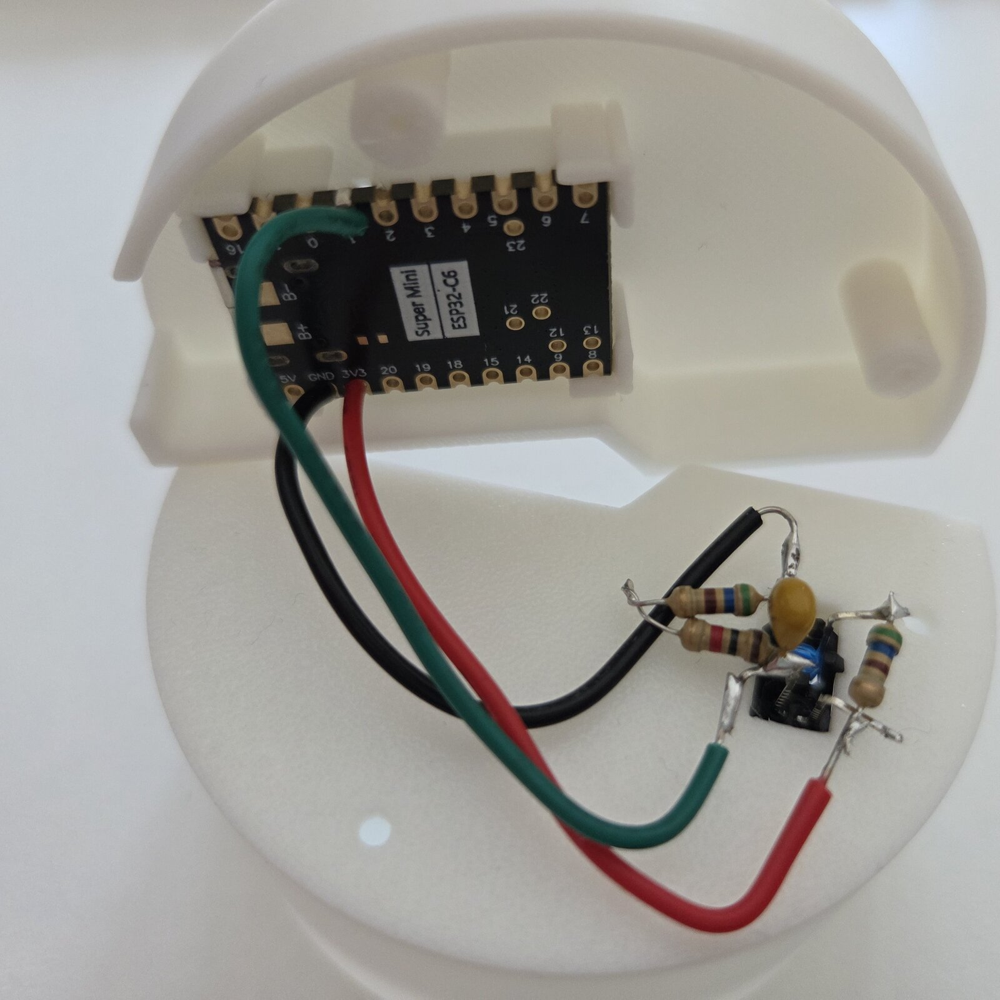 | 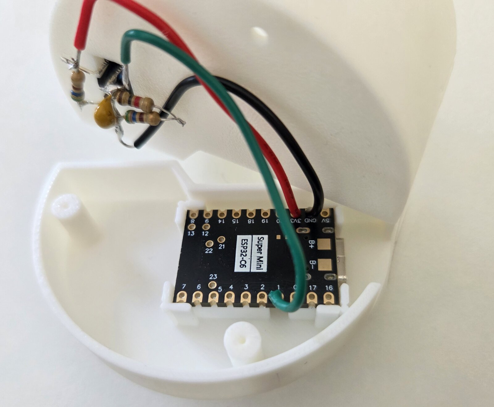 | 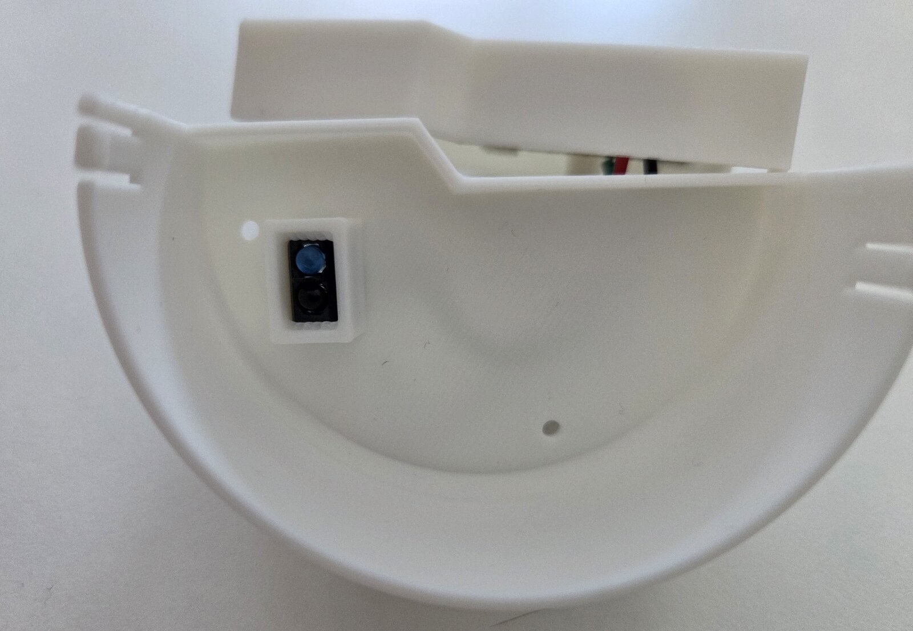 |
|---|---|---|
| wired: board in the cap, sensor with R1/R2 in the adapter | board snapped in between the corner brackets | sensor sitting in the sleeve |
| 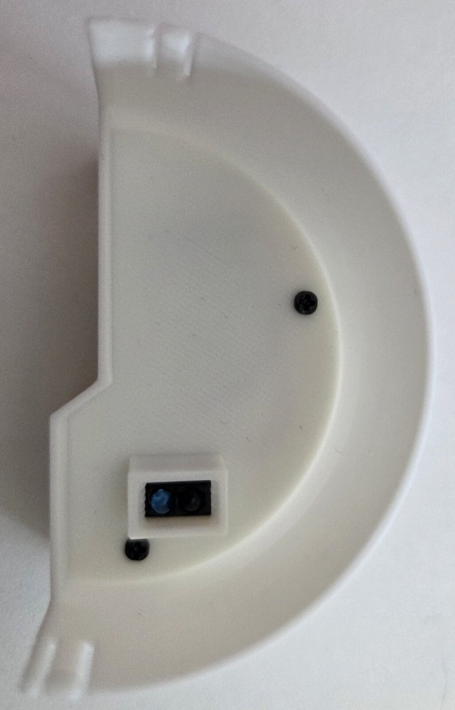 | 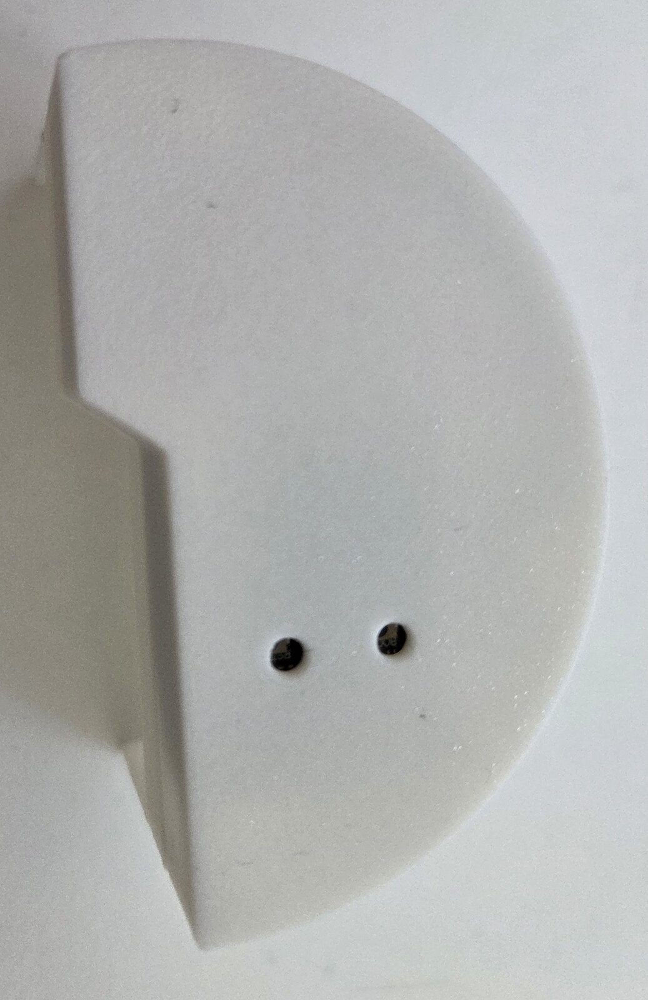 | 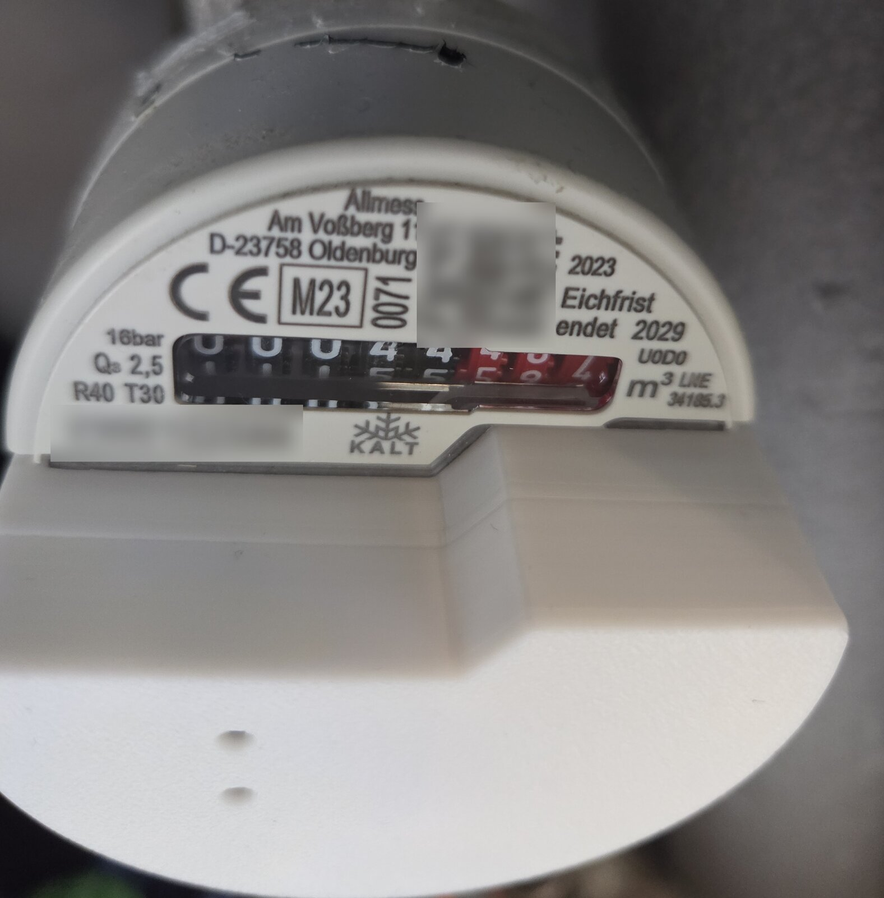 |
| adapter from behind: sensor sleeve and the two screws | cap from outside: holes for BOOT and RST | mounted on the meter |

To take it off again, pause counting in the web interface first, see
[tuning](../../docs/tuning.md).

## Tested values

**No changes needed for this meter**: these are the firmware defaults.

| | |
|---|---|
| R1 (IR LED series) | 560 Ω |
| R2 (phototransistor emitter) | 1.56 kΩ (1 kΩ + 560 Ω in series) |
| Signal, black sector | ~500 mV |
| Signal, chrome sector | ~2900 mV |
| Swing | ~2.4 V |
| Thresholds | 2200 / 1200 mV |
| Dwell | 80 ms |
| Minimum gap between edges | 150 ms |
| Volume per edge | 0.5 L |


How these were found, and what to change for another meter, is in
[hardware](../../docs/hardware.md) and [tuning](../../docs/tuning.md).
